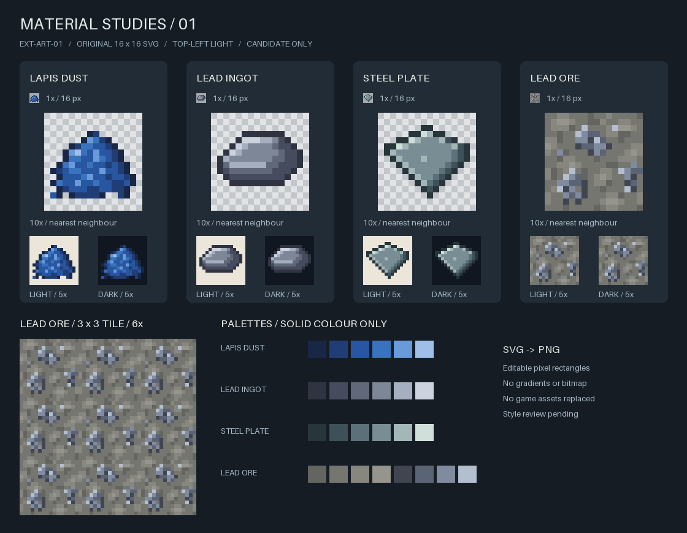

# 资源生产与美术：第一轮评审检查点

**状态：** 2026-09-29 用户明确批准四张样稿风格，并要求按此重绘现有美术资产；同时采用本页三矿推荐方案。决策门已解除，进入 [EXT-A-ORE-01](../../superpowers/plans/2026-09-29-ext-a-ore-01.md) 与 [EXT-ART-02](../../superpowers/plans/2026-09-29-ext-art-02.md) 实现。两项实现已形成候选，当前进度见 [客户端验收检查点](./implementation/README.md)。本页保留决策与原始准备证据，批准不代表客户端验收完成。
**授权与任务：** [启动计划](../../superpowers/plans/2026-09-29-resources-production-art-start-plan.md)。用户于 2026-09-29 授权自动派发，决策或手动测试暂停。

## 1. 已形成的交付

- **EXT-ART-01：** 青金石粉、铅锭、合金钢板、铅矿石四张原创像素 SVG，导出 16×16 RGBA PNG；候选预览见下方。导出器与源稿位于 `codex/svg-material-pilot` 的候选提交 `49e6c86e4219125b695f7f13a09d28cdccaff8c0`，未合并、未推送，没有接入 `src/`。
- **EXT-A-START-01：** [最小批次与决策报告](./EXT-A-START-01.md)，复用此前审计并核对 Minecraft 1.21.1 / Create 6.0.10-280 原始数据。完成的是静态准备；下列推荐数值现已获用户批准，作为首轮试验值，尚未完成游戏验证。
- 材料加工接续为粗矿熔炼→锭→板、制钢与零件；材料可达后再做首台离心机制造和最小工作循环，随后烧结与装配。每批冻结自己的参数，不把整条链一次交给执行者。

## 2. 美术风格确认

这是 16×16 原图及最近邻放大、浅/深背景和矿石平铺对照。PM 已查看最终静态图；自动检查覆盖源稿与 PNG 一致、尺寸、色板、二值透明度及可复现。尚未进行游戏客户端验收。

**已确认：** 采用这套轮廓、色板和明暗方向，并覆盖现有全部 51 张 PNG（含已有反应堆平面贴图）。复杂设备模型和新增动画不在本批。

## 3. 三矿资源入口的首轮建议

第一实现批以“三矿自然生成→挖掘→Create 原生粉碎粗矿”为出口，暂不含洗矿、富集、完整设备或发电。以下推荐已批准并写入正式实现卡。

| 矿物 | Y 高度范围 | 分布峰值 | 每区块尝试 | 矿脉规模参数 | 空气暴露丢弃 |
| :--- | :--- | :--- | :--- | :--- | :--- |
| 铅 | -48～32 | -8 | 6 | 7 | 0 |
| 锡 | -16～112 | 48 | 12 | 8 | 0 |
| 铀 | -64～-16 | -40 | 2 | 4 | 25% |

全部为三角形高度分布，面向主世界资源获取；不设首轮专属群系奖励。次数与规模是生成算法参数，不是保证矿块数量；要在后续新世界采样与玩家采集验证后评估平衡。可配置、可关闭及等价矿物默认去重沿用原有要求，不重新提请批准。具体维度过滤和标签生命周期由实现卡明确，不能把群系标签当严格维度过滤。

**同批获取建议：** 锡使用石镐及以上，铅/铀使用铁镐及以上；正确工具普通挖掘掉 1 份粗矿，精准采集掉对应矿石，时运沿用铁矿规则。错误/低等级工具无掉落，矿石无额外挖掘经验；爆炸沿原版掉落衰减。三种粗矿各 9 份可逆压缩为 1 粗矿块，粗矿块使用对应工具等级，掉自身且不受时运增产。

**粉碎建议：** 保留锁定 Create 已有九条配方，不再增加同输入竞争配方。三个矿种规则相同：

| 输入 1 份 | 确定产出 | 概率产出 |
| :--- | :--- | :--- |
| 普通/深层矿石 | 1 粉碎粗矿 | 75% 多 1 粉碎粗矿；75% 得 1 经验颗粒 |
| 粗矿 | 1 粉碎粗矿 | 75% 得 1 经验颗粒 |
| 粗矿块 | 9 粉碎粗矿 | 最多 9 经验颗粒，每颗独立 75% |

原配方均为 `processing_time=400`，实际耗时由 Create 决定，不能解释成固定秒数。**用户已接受经验颗粒方案，包括铀矿不产副石料；PM 已同步配方表。** 所有粉碎收益是依赖配方事实，不是本轮运行测试结果。

**已确认：** 采用表中三矿生成、工具掉落/粗矿块和原生粉碎方案。铀保持 2 次、暴露丢弃 25%；原 3 次/零丢弃备选没有采用。

## 4. 后续门与暂停边界

本轮不把 D-03e 视为已批准，也不要求重复确认 D-01 至 D-03d。铅锡粒换锭的数量/工序、洗矿产率、制钢与首机配方和运行参数放在对应批次集中处理；当前不提交整线成本或吞吐承诺。

PM 已细化三矿实现卡及现有资产重绘卡；青金石粉候选后续复用获批源稿，其余整改门保留。游戏接入仍须各卡自动验证和客户端验收。此检查点不是合并候选、完成生存链或发布版本的声明。

## 5. 保存与复核证据

- [美术执行报告](./EXT-ART-01.md)、[独立审查](./STARTUP-DELIVERY-REVIEW.md)、[启动决策包](./EXT-A-START-01.md)。PM 核对了原生九条配方数据，并独立运行导出器，退出 0，六个派生文件 SHA-256 前后一致；实际查看最终预览。
- [原始证据与候选源文件包](./startup-evidence.zip) 保存两项报告/证据、独立复核以及 `art-assets/` 全部 13 文件；包中各任务证据目录与同名报告并列。恢复时将报告/证据置于 `build/reports/extension/`，`art-assets/` 置于候选工作树 `tools/`，不要运行首次草图脚本覆盖后续 SVG。
- 原始预览 SHA-256：`ec777949ab98daeb7766c9550cd7e9ebd06ddd4aa8e92463d1d410433823af58`。
- 客户端、自然生成采样与真实加工未执行；本轮未修改游戏代码、构建、配置或存档，用户 `.vscode/launch.json` 保持原哈希。
- 证据包 SHA-256：`CC36739DE5EFF8554F6CACEE17CD1739D1D3B378696F01D565403F498FD5B1F7`。
