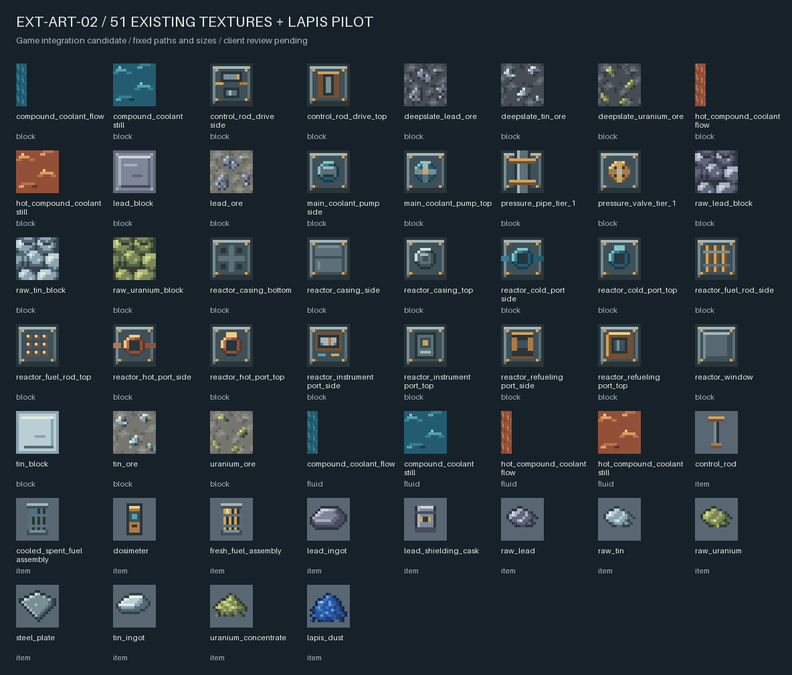

# 三矿资源与美术重绘：客户端验收候选

**状态：** 用户于 2026-09-29 确认三矿自然生成与采集正常，认可其他重绘素材，指出两种冷却剂不如旧版，并明确选择恢复旧冷却剂、保留其余新素材；2026-10-01 进一步确认三矿粉碎轮加工测试通过。[冷却剂恢复整改 EXT-ART-02A](../../../superpowers/plans/2026-09-29-ext-art-02a-coolant-restore.md) 已通过 PM/独立审查，资源候选 `b4d78d5b934f39e5cc2172635cda4c6313c74a40` 等待冷却剂视觉复验。粗矿 9:1 合成/拆解、保存退出后重进继续保留待验收。候选未合入 main、未推送或发布。本批只到三矿获取、粗矿压缩、Create 粉碎与现有贴图调整；材料熔炼/洗矿、制钢及新设备制造继续在后续批次。

## 1. 本批内容与验证

- 三矿各有普通/深层矿石、粗矿和粗矿块；工具等级、掉落/时运/精准、9:1 可逆压缩及 Create 原生粉碎规则按已批准合同实现。世界生成支持数据包配置、关闭、强制开启和默认等价矿石去重。
- 51 张现有 PNG 按批准风格重绘，路径/尺寸保留；四张 flow 维持 16×64，其他为 16×16。开发源稿采用 SVG，青金石粉样稿仍只在工具候选中，本批不引入未验收的青金石粉功能。
- 最终 JUnit 为 **265 / 0 失败 / 0 错误 / 0 跳过**。GameTest 日志记录 **116 required 断言通过**（111 既有、4 新功能、1 在平坦测试世界明确跳过自然采样）；随后保存挂起，强停退出 1，保留为框架运行限制，不写成正常退出成功。
- 自然生成另用普通服务端三个固定种子各采样 64 个新生成区块，共 192 个区块，三矿均非零，正常保存退出 0。四类数据包（外部矿石默认去重、强制开启、关闭、只有外部物品标签）也在普通服务端验证。统计是实现证据，不代表平衡/采矿体验已通过。
- 普通铀矿在三个自然样本中计数均为 0；当前批准高度主要落在深层板岩区域，不能称六种形态全部自然发现。另一个样本在 Y=49 发现深层锡矿，定点邻居为深层岩；锁定 Create 的条带矿层可以在高处生成深层岩，矿石按替换标签选择形态，不按绝对高度改成普通纹理。这是源码与现场支持的解释，本轮未逐步追踪该块的 feature 执行。

世界生成 configured/placed feature 及 mode 的数据包覆盖需要保存并重启服务端后作用于新区域；仅 `/reload` 不会重建该动态注册表。auto 模式读取的方块标签则可随标签数据包重载更新，已分别验证，不能混用两种生效边界。`auto` 为默认，`enabled` 强制开启，`disabled` 关闭；三模式均受主世界维度限制。

## 2. 获取候选与启动

**2026-10-01 开发环境更新：** 当前候选分支 HEAD 为 `39db2b4`，在玩法/资源候选 `b4d78d5` 上增加并修正 JEI `19.27.0.340` 的开发客户端依赖。初版 `9c4fb39` 把 JEI 放入 legacy 启动库清单，实际未注册为模组；本次改为仅加入三个客户端的实际 classpath。主工程已通过真实隔离启动的注册/资源加载验证，候选同步后实际 classpath 与启动准备复核通过。用户随后确认 JEI 界面出现，界面显示已通过实测，配方查询交互未单独确认。JEI 不内嵌到下方测试 JAR，玩法及冷却剂人工验收状态不变。详见 [DEV-JEI-01A](../../../superpowers/plans/2026-10-01-dev-jei-01a.md)。

[下载/打开冷却剂恢复后的测试 JAR](../../../../build/reports/extension/client-candidate-2026-09-29/create_nuclear_industry-0.1.0-ore-svg-coolant-restored.jar)。它是内部版本仍为 `0.1.0` 的测试候选；在测试客户端 mods 目录替换本模组旧 JAR，同一模组保留一份，NeoForge/Create 等依赖维持本页列出的锁定版本。

**最新资源修订 EXT-ART-02A：** 两种冷却剂的 8 张 PNG 逐字节恢复到重绘前版本，其他 43 张游戏 PNG 保持 `c92e762` 的新素材。`processResources jar prepareClientRun` 退出 0；JAR 中全部 51 张贴图与当前候选逐字节一致。当前 JAR SHA-256 为 `4ba7b0aa2a25c30d1fddc29d7e4ea2f50b66101c6ffca32a368a8e685efc65f5`。本次未改 Java/数据/构建，不重复运行全量游戏逻辑测试；下文 `c92e762` 和旧 JAR 哈希保留上一轮自动验证语境。

也可直接从已整合的隔离工作树启动开发客户端：

```powershell
Set-Location 'E:/MyMC/NewMod/Create_NuclearIndustry-ore-acquisition'
$env:JAVA_HOME = 'C:/Program Files/Java/jdk-21'
./gradlew.bat runClient
```

主工作区保存文档和用户既有配置；本次候选在上述工作树 `codex/ore-acquisition` 分支，原始整合提交 `c92e76282828927915dea5b5b3be399cb880eaab`，当前增加冷却剂恢复提交 `b4d78d5`。功能提交为 `16cd164`，美术提交为 `eddd097`。原始整合构建实际重跑 JUnit，265/0/0/0，build exit0；当时 JAR 内 51 张贴图与审核源输出逐字节一致，六压缩配方和矿物注册/过滤器类已核对。GameTest 功能证据来自整合前相同 Java/数据实现，纯 PNG 整合没有再次运行 GameTest。

2026-09-29 按用户要求，将两个隔离工作树迁到主工程同级目录：整合候选在 `E:/MyMC/NewMod/Create_NuclearIndustry-ore-acquisition`，美术分支在 `E:/MyMC/NewMod/Create_NuclearIndustry-svg-art`。迁移前后 3,304 个文件完成逐文件 SHA-256 核对（重建 Git 登记后仅 `.git` 指针按新位置变化），忽略的构建产物、测试世界和报告一并保留；两分支候选提交与测试 JAR 哈希不变。旧 C 盘工作树通过 Codex 归档接口保存恢复快照并清理，应用中的旧附件属于历史归档，不是当前启动位置。历史交付报告中的 C 盘路径保留当时运行语境。

搬迁后已在整合候选运行 `runClient --dry-run` 和 `classes prepareClientRun`，均退出 0；启动参数已重新生成。此项只验证启动准备，不代表本批客户端人工验收通过。迁移清单保存在主工程 `build/reports/maintenance/2026-09-29-worktree-relocation/`。

上一轮 `c92e762` JAR SHA-256：`319101981b8e05ec53c0ddf3c0840dcf3ec12d04ba96337aad6dcd65e96234c7`。该旧包保留在主工程测试包目录的 `create_nuclear_industry-0.1.0-ore-svg-candidate.jar`；候选工作树 `build/libs/create_nuclear_industry-0.1.0.jar` 已更新为上述冷却剂恢复版本。这些构建文件未纳入 Git；可从对应候选提交复建。

## 3. 客户端操作与预期

截至 2026-10-01，用户已确认三矿自然生成、采集及粉碎轮加工通过，无需重复测试。剩余人工项为粗矿 9:1 合成/拆解、保存退出后重进，以及恢复旧外观后的冷却剂静止和流动面复验。本次粉碎轮确认不自动覆盖这三项。

使用本候选及锁定 Minecraft 1.21.1 / NeoForge 21.1.219 / Create 6.0.10-280 环境。建议先用新的测试世界，seed `20260929`；默认去重会在外部矿物模组提供等价矿石标签时关闭对应本模组矿物，此时种子坐标不再作为匹配保证。旧存档只在新生成区域添加矿物，不回填已经生成的区块。

| 检查 | 操作与预期 |
| :--- | :--- |
| 资源加载与辨识 | 创造栏查看三矿六种矿石、三粗矿、三粗矿块；检查物品栏/手持/放置无紫黑，铅锡铀可辨，粗矿块不同于自然矿石。 |
| 既有资产 | 查看反应堆外壳顶/侧/底、冷/热/换料/仪表端口和控制棒驱动器；观察窗中央可透视；冷/热冷却剂分别冷蓝/暖色，流动面无明显裁切异常。对照下方总览。 |
| 生存采矿 | 在生存模式用石镐采锡、铁镐采铅/铀，普通掉 1 粗矿；低一级镐和非镐无矿物掉落。精准采集掉对应矿石，时运可增加粗矿（单次未增产不是失败），无额外挖矿经验。 |
| 粗矿块 | 各 9 粗矿合成 1 块，再拆回 9；对应工具等级挖粗矿块掉自身，时运不增加块数。 |
| 实际粉碎（已通过） | 用户于 2026-10-01 确认三种矿物粉碎轮加工测试通过。原检查目标：三矿分别投入矿石、粗矿、粗矿块，检查稳定出料；保证量分别为 1、1、9 粉碎粗矿。概率副产物按原生 Create 规则波动，不应生成副石料或重复吞吐。用户未提供逐次出料记录，不补写实测数量或概率统计。 |
| 新区块与保存 | 到未生成区域寻找自然矿，保存退出后重进确认矿石/库存保留；旧世界可用副本检查新区域，已有结构和燃料状态不应变化。 |

纯基线 seed `20260929` 的实测矿块坐标（测试世界可开指令协助定位，再切回生存采集；生成顺序或其他模组可能造成差异，以实际世界为准）：

| 矿物 | 实际矿块坐标 X/Y/Z |
| :--- | :--- |
| 普通铅矿 | `1935 / 10 / 1926` |
| 普通锡矿 | `1921 / 33 / 1920` |
| 深层锡矿 | `1924 / -4 / 1920` |
| 深层铀矿 | `1920 / -48 / 1929` |

只需反馈上述检查是否通过；若有问题，附具体对象、操作和现象。当前自动推进将停在本轮客户端门，不能沿用之前 P1 手测结论代替本批。通过后再推进基础材料加工和设备制造，新的玩法参数在对应批次集中确认。

## 4. 美术与保存证据

当前冷却剂恢复结果见 [预览](./coolant-restored.png)、[整改交付](./EXT-ART-02A.md)、[独立审查](./EXT-ART-02A-REVIEW.md)、[PM 制品核对](./EXT-ART-02A-artifact.json) 及 [整改证据包](./coolant-restore-evidence.zip)。下方总览和初轮报告保留原重绘候选语境，其中冷却剂已经被当前恢复版本取代。



- [矿物交付](./EXT-A-ORE-01.md)、[矿物独立审查](./EXT-A-ORE-01-REVIEW.md)、[最终制品核对](./integrated-artifact.json)。
- [原始验证证据包](./implementation-evidence.zip)：241 项，包含两交付/两审查、JUnit XML、普通服/数据包日志和可复制包、GameTest 成功及失败/停止记录、SVG 验证证据、整合构建记录与从 `adaf347` 到候选的源码/资产二进制补丁。没有打包测试世界；种子、配置和坐标足以重建采样环境。证据包 SHA-256：`0fc7493dff1bc91c1c776802155d172185ef1e20e1561b4c08fd38e557ec8c98`。
- [美术交付](./EXT-ART-02.md)、[美术独立审查](./EXT-ART-02-REVIEW.md)、[派发合同审查](./EXT-START-IMPLEMENTATION-REVIEW.md)。
- 艺术候选提交 `eddd0971c30446070ceb988248c3609a4c391ef8`。PM 实际看完八页对照及总览；额外运行默认导出，52 张候选与 8 页对照共 60 文件哈希均未改变。只修正工具 README 的末尾空行；不改实现或图形。
- 用户主工作区 `.vscode/launch.json` 保持原 SHA-256 `65EBB9ECB32C45F3254E2F511D3D134B17829E2FF0D73B7CB8094583EDE18C07`；候选和证据放在隔离工作树及本检查点。未推送或发布。
