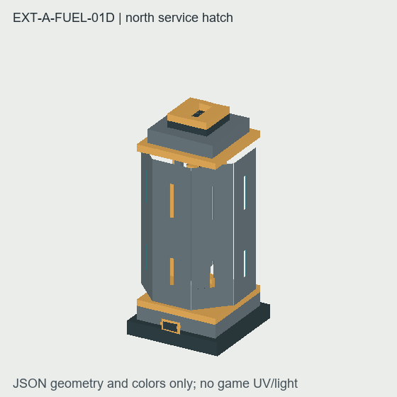
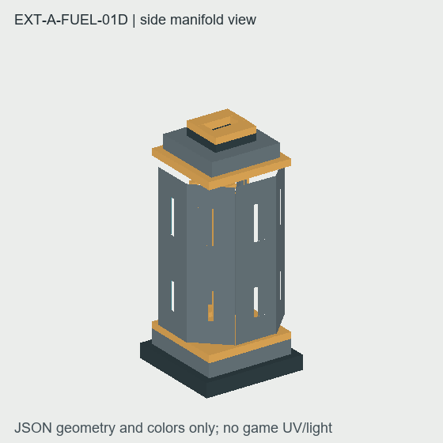

# EXT-A-FUEL-01D 资源交付

基于候选基线 `4ade0dce365893afefa614c642cbe4de0fb42a4a` 完成离心机资源线。模型按 1×1×2 设备构造：下段轴承底座与八棱鼓下部、上段鼓壳与收口顶盖；模型范围没有越出占用方块。顶部留中央料浆口，底座北面以检修盖和双螺栓标出轴承维修朝向。四个正交面和四个斜面均保留相同的窄观察孔，没有绘制固定产物或水的侧向标记。

鼓壳由八片独立侧板组成，斜向四面使用 Minecraft 模型元素支持的 ±45°旋转。定点检查发现东南斜面朝向错误造成一列缺口，已修正为外侧面并重新生成最终预览。各面中央开出宽 0.75、高 4 格的真实观察孔，没有不透明盖板遮挡转子；转子静态几何可从孔中看到。模型元素均未设置 `cullface`，避免邻接方块把小于整格的斜面误剔除。完整设备模型合并上下壳体和转子，用于物品栏与手持显示。

| 文件 | 内容 |
| :--- | :--- |
| `blockstates/enrichment_centrifuge.json` | `half=lower|upper` 与四向 `facing` 的 8 种状态组合 |
| `models/block/enrichment_centrifuge.json` | 本地 0..16 下段，57 个几何元素 |
| `models/block/enrichment_centrifuge_upper.json` | 本地 0..16 上段，59 个几何元素 |
| `models/block/enrichment_centrifuge_item.json` | 本地 0..32 完整设备，139 个几何元素 |
| `models/block/enrichment_centrifuge_rotor.json` | 独立转子，23 个元素，轴心 `(8,16,8)`、范围 y=5..27 |
| `models/item/enrichment_centrifuge.json` | 物品引用完整设备模型；GUI 缩放 0.45，手持缩放 0.38 |
| `textures/block/enrichment_centrifuge_{casing,brass,glass,dark}.png` | 4 张 16×16 PNG，由对应 SVG 源稿导出 |

斜面旋转后的几何范围核对如下，转子范围以整机下段底面为原点：

| 部件 | 最小坐标 | 最大坐标 |
| :--- | :--- | :--- |
| lower | `(0.8, 0, 0.38)` | `(15.2, 16, 15.2)` |
| upper | `(0.8, 0, 0.8)` | `(15.2, 16, 15.2)` |
| 完整物品 | `(0.8, 0, 0.38)` | `(15.2, 32, 15.2)` |
| 转子 | `(4.22, 5, 4.22)` | `(11.78, 27, 11.78)` |

两张预览由最终 JSON 方块几何和转子元素生成，角度分别展示北面检修盖与侧面鼓壳。图片采用模型材质配色近似；不模拟 Minecraft 的 UV 采样、环境光或游戏渲染，因此不能代替客户端外观确认。





本机预览/导出工具为 [centrifuge_01d_preview.py](/E:/MyMC/NewMod/Create_NuclearIndustry-ore-acquisition/tools/art-assets/centrifuge_01d_preview.py)；4 份 SVG 源稿位于 `tools/art-assets/sources/block/enrichment_centrifuge_01d_*.svg`。工具通过现有 `tools/art-assets/export.py` 的严格 SVG 光栅器导出 PNG，不修改共享导出管线。观察孔是实际几何开口，未添加透明盖板或额外渲染层。

执行命令：

```powershell
& 'C:/Users/IKSXH/.cache/codex-runtimes/codex-primary-runtime/dependencies/python/python.exe' -B tools/art-assets/centrifuge_01d_preview.py
```

工具执行成功，并核对 8 个 blockstate 引用、lower/upper/item/rotor 的 JSON 结构与 PNG 纹理引用、允许的旋转角度、没有 `cullface`、所有模型占位边界和 4 张 PNG 的 16×16 RGBA 尺寸。几何范围及元素数量记录于[核对证据](./assets/geometry-check.json)；JSON 几何预览见本目录两张 PNG。未运行 Gradle、JUnit、GameTest 或 Minecraft 客户端。实际游戏 UV/光照、放置尺寸和手持观感仍由运行线打包后客户端确认。

实际使用技能：`minecraft-modding/SKILL.md`（核对资源与模型边界、项目版本）；`minecraft-testing/SKILL.md`（将检查限定在本批资源引用/几何范围，不将预览当作游戏验证）；`minecraft-resource-pack/SKILL.md`（模型、blockstate、纹理引用和 PNG 规范）。工作树中的 Java、语言和测试文件由运行线并行修改，不属于本资源线写集。
