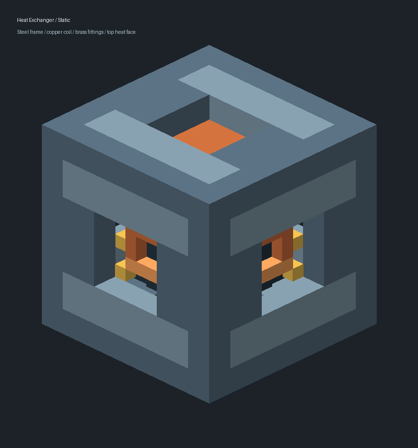

# 首台核换热器：客户端候选与验收

**01A初版交付记录：自动验证通过，未获客户端人工验收。** 用户于2026-10-04要求降低成本并重绘模型；当前按[01B修订](../../../archive/2026-10-08-completed-plans/2026-10-04-heat-exchanger-cost-model-revision.md)实施工作台9格与顶部鳍片/底部基座。下文原21格制造、模型与证据保留历史语境，不作为新外观/配方验收目标。未变运行合同见[01A实施卡](../../../archive/2026-10-08-completed-plans/2026-10-03-ext-b-exchanger-01a.md)及[确认方案](../../../archive/2026-10-08-completed-plans/2026-10-03-nuclear-heat-exchanger-proposal.md)，仍只供Create储罐锅炉。

## 制造与接口

- 钢锭切石1→2钢管坯，Create机械锯沿原生切石兼容。
- 工作台竖排坚固板/精密构件/钢板，各1→1强化钢板。
- 管束工作台：4管坯放四角，中行铜片/强化钢板/铜片→1核换热管束。
- 21格动力合成器制造1核换热器：12钢板、4铜片、2耐压接头、2管束、1工业传感器。S钢板、C铜片、P接头、H管束、I传感器：

```text
 SSS
SCPCS
SHIHS
SCPCS
 SSS
```

首末行末尾各补一个空格。无序列装配、额外加热、副产物。

换热器顶面贴Create锅炉底层，其他五面均可输入热复合冷却剂、抽出冷复合冷却剂；需要管道/泵确定流向，无机身过滤槽、转轴或GUI。冷热罐各4000mB，无热液手持桶。

## 启动位置

本批运行实现保留在同级候选，主目录尚不包含新换热器。完全退出旧客户端后：

```powershell
Set-Location 'E:/MyMC/NewMod/Create_NuclearIndustry-ore-acquisition'
$env:JAVA_HOME = 'C:/Program Files/Java/jdk-21'
.\gradlew.bat runClient
```

不移动或改写用户既有存档。使用原测试世界或其副本测试即可。

## 合并人工清单

| 组别 | 操作与预期 |
| :--- | :--- |
| A 制造与视觉 | JEI可查询三材料及整机；按以上路线制造。检查物品栏、手持、放置、四朝向和工作热态，无紫黑、透明漏缝或闪烁条纹。整机占满单格，空手右键不打开GUI；护目镜能读出罐量和工作状态。 |
| B 真实热循环 | 顶面紧贴有蒸汽引擎/汽笛、持续供水的Create储罐锅炉底层；用Create管道/泵从反应堆热端输入，并把冷液接回冷端。默认有效预热40tick（正常20TPS下2秒），首轮1440mB热液返1440mB冷液后供热；持续额定36mB/t，冷热1:1。锅炉热源18级；要用满18级需至少72储罐（如3×3×8）和180mB/t供水，较小锅炉仍按原生体积/水量限制，换热器显示提示。观察实际蒸汽引擎驱动，不把热源数字单独当作发电通过。 |
| C 停机与恢复 | 切断热液管后，注意内部4000mB热罐仍会继续供料，须等热罐用尽才进入余热；也可停冷液回流使冷罐满。两者均停止转换，只有已付余热，至多40tick后熄灭。恢复供料/排液能正常恢复，无库存复制。拆掉上方负载时不转换热液；正常拆除或潜行扳手收起后仅回收一台，重放保留冷热液及热储备；离开使区块卸载再返回、保存重进均不刷新免费预热/余热，机器与锅炉能正常恢复。 |

供水状态沿Create原生采样估计，断水显示可能滞后；无需额外接耗能设备才被认作有效负载。无锅炉或只有储罐而没有引擎/汽笛时不正常耗液。本批固定额定消耗，不按小锅炉负载比例返还热量。

## 自动验证与证据

[独立复审](./EXT-B-EXCHANGER-01A-REVIEW.md)已完成，所发现停tick热缓存缺陷已整改，复审范围内无剩余已确认P1/P2运行缺陷。此结论不替代下列人工门。

- [设备报告](./EXT-B-EXCHANGER-01A-DEVICE.md)、[材料报告](./EXT-B-EXCHANGER-01A-MATERIAL.md)、[模型报告](./EXT-B-EXCHANGER-01A-ART.md)。7个不同账本JUnit通过：[首轮5项](./EXT-B-EXCHANGER-01A-DEVICE/junit-first.xml)、[补充2项](./EXT-B-EXCHANGER-01A-DEVICE/junit-added.xml)；账本代码未随生命周期整改改变，复用这些证据。
- [最终运行日志](./EXT-B-EXCHANGER-01A-DEVICE/validation-liveness-fixed.log)：10/10 required GameTest及assemble通过，服务端正常退出。覆盖真实4/72罐锅炉供热与供水限制、查询/模拟纯度、制造工序、单件生存采集携物、跨区块BE钩子，以及FULL但非ticking的缓存撤热/管道恢复。
- FULL边界测试固定真实LevelChunk的原生FullStatus门，并保存恢复原supplier；实际实体50tick不记账而相邻锅炉清热，恢复后重新有偿预热。它不是自然玩家距离票据迁移或磁盘卸载，这些仍保留人工项。
- 首轮两处失败来自测试准备（onLoad前填液、原生网格缺calcStats）；独立复审另定位停tick源导致锅炉缓存持续供热的真实缺陷，现已以仅跟踪活动热源的机制修复。原不稳定TickingTracker测试门被原生票据覆盖的失败/诊断日志一并保留，未削弱生产守卫。未跑旧全量。
- [PM制品核对](./EXT-B-EXCHANGER-01A-DEVICE/pm-artifact-check.json)：40个本批变更资源与JAR逐字节一致，7个关键类存在。测试JAR为同级候选`build/libs/create_nuclear_industry-0.1.0.jar`，SHA-256：`ED6AF677555C0EC86ED8AC71F57A3D582D34801F10B3DAB21F1D5E29A3FC50C8`。
- 静态预览与[热态预览](./EXT-B-EXCHANGER-01A-ART/heat-exchanger-lit-preview.png)仅是离线几何效果；同朝向共面检查见独立复审，不能用体积不相交直接替代游戏视觉检查。



PM已备份本轮测试产生的根日志并恢复其基线，未改用户客户端或存档；被旧忽略规则匹配的独立配置类已精确纳入Git索引。自动通过不等于客户端验收通过；本批人工门前不推进后续盆/蒸汽功能。
