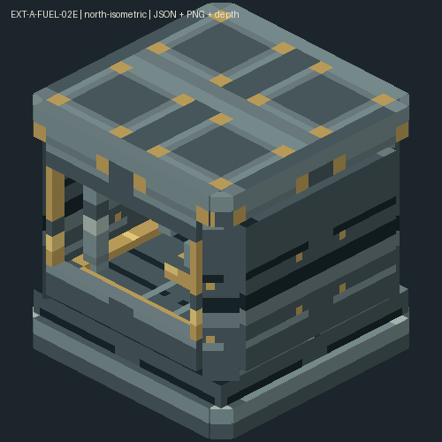

# 燃料02E：八格屏蔽装配台候选

**状态：候选已就绪，自动验证及独立审查通过，待四组客户端人工验收。** 用户已批准[完整方案](../../../superpowers/plans/2026-10-03-shielded-assembly-multiblock-proposal.md)，执行范围以[实施卡](../../../superpowers/plans/2026-10-03-ext-a-fuel-02e.md)为准。四料8/4/2/1加工和运行参数沿用02D；结构改2×2×2、四周漏斗输入/出成品、21格制造，并拆分模型活动件供未来动画使用。

功能提交`41f90a2`，分支`codex/ore-acquisition`；main本轮只同步文档和证据，未合入02D/02E功能，未推送或发布。用户主目录launch配置保持原样。自动推进停在本页人工门，不继续冷却剂或其他玩法。

## 启动位置

完整退出旧客户端，从同级目录启动；在主工程目录运行仍不会加载本批改动：

```powershell
Set-Location 'E:/MyMC/NewMod/Create_NuclearIndustry-ore-acquisition'
$env:JAVA_HOME = 'C:/Program Files/Java/jdk-21'
.\gradlew.bat runClient
```

## 合并手测清单

| 组别 | 操作与预期 |
| :--- | :--- |
| 制造、放置与外观 | 用21格动力合成器按` LLL /LSSSL/LDRDL/LSSSL/ LLL `制造，L铅板、S钢板、D完整机械手、R辐射传感器，产1台；旧工作台配方不再可用。JEI可查。一次放出2×2×2，空间被占时不消耗或覆盖。观察四朝向、放置/手持/物品栏、八格拼缝及窗口内独立部件；这批装配臂/夹具处于待机位置，不要求播放后续动画。 |
| 任意侧漏斗物流 | 用安山/黄铜漏斗分别向不同高度、不同侧的机身投入四料；输入不局限于顶部。侧面输出漏斗只能抽成品、不能抽原料；多个位置共享库存，不复制产物。顶部四个位置仍能投料，底部不接受物料，机器无GUI。 |
| 生产与动力 | 按标记在底部单轴口接动力，8芯块/4包壳/2焊料/1格架在64RPM约20秒产1正式满耐久组件；停轴/不足32RPM/过载/满输出时暂停，恢复后续作。护目镜从任意机身部位看到同一库存/进度。成品可以沿原外置置物台/机械臂路线接入既有合法换料端口。 |
| 保存、拆放与旧机升级 | 带库存/进度保存退出再进；在生存模式从不同部位普通挖掘或潜行扳手收回，仅得1件携物整机，无额外原料掉落，重新放置恢复。原世界02D单格机暂停并提示升级，库存可取回，收起后在足够空间重放为八格并保留物料/进度；不自动覆盖邻居。普通扳手提示收起重放改变朝向。跨区块摆放后离开再返回，确认结构和库存恢复。 |

时间按20TPS。只验证本批变化；无需重复已验收离心机/烧结炉全套流程。旧02D未通过的原尺寸/制造/物流人工项由本页新清单替代，不追记为通过。当前无02E客户端验收证据。

## 证据

- [运行报告](./EXT-A-FUEL-02E-runtime.md)：终版隔离GameTest于2026-10-03 16:09:27通过全部5项required测试，随后正常保存、退出；[原始日志](./evidence/gametest-latest.log)。覆盖真实漏斗、机械臂、底轴生产、过载/满输出、八拆点携物、旧数据和孤儿清理；未改的State三项JUnit复用02D证据。
- [最终构建输出](./evidence/assemble-final-console.txt)：增量assemble退出0。实际因审查修复与保留原断言共打包4次，未跑全量build/test或clean；不是声称只执行一次构建。
- [制品清单](./evidence/jar-inventory.txt)和[逐项字节核对](./evidence/jar-byte-compare.txt)：38项本批资源与源一致，旧9格制造已不在JAR。最终JAR SHA-256：`059116471CF42FF5267D4F2F2082F7858FD0562FB6A5AAA6028C1B07CBADC8D0`。
- [素材报告](./EXT-A-FUEL-02E-assets.md)及[资源核对](./evidence/resource-check.json)：103张旧PNG不变，16个静态模型、3个活动partial与10张新纹理。PM已查看全部方向和物品预览并冻结资源。
- [唯一独立审查](./EXT-A-FUEL-02E-REVIEW.md)：已知重复掉落、客户端同步、工作灯、旋转符号及延后孤儿清理均已整改，无剩余确定性阻断项。[只读探针](./EXT-A-FUEL-02E-PROBE.md)仅保留技术路线依据。

未加载自动场景使用远处不可用主控位置和延后改指已加载空位置，不能替代真实跨区块卸载/恢复；客户端外观、JEI制造、护目镜与拆放手感同样留在四组人工门。不能把离线预览或自动通过记为用户手测通过。

下图来自实际模型JSON、PNG和待机partial的离线组合预览，不是客户端截图：



[活动空间示意](./previews/motion-envelope.png)：左右装配臂各预留向内1模型单位，中央夹具向上3单位；内端接触夹具但不穿入。此批只完成拆件和待机显示，具体动画另批实施。
