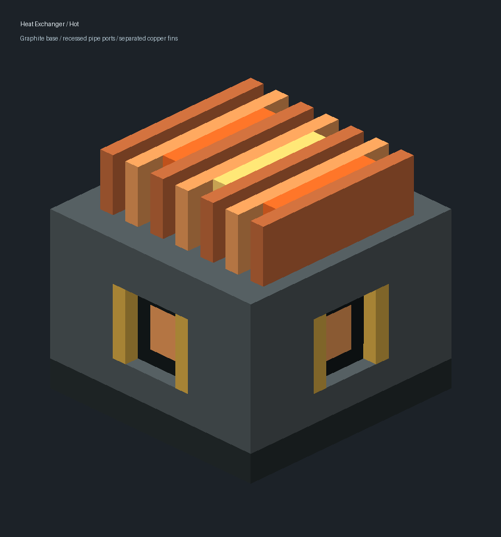

# EXT-B-EXCHANGER-01B ART 交付报告

**执行基线：** `72b453fe522e2c39337ce869d46ad58b06c3e850`  
**范围：** 仅换热器方块状态、模型、纹理、`tools/art-assets/heat-exchanger-device/` 及本报告/01B证据目录。未修改Java、配方、其他材料素材或依赖。

## 交付结果

- 移除全高笼架造型，替换为完整深灰方形基座（Y=0..12）和顶部七条相互分离的铜鳍片（Y=12..16）。鳍片之间保留实体空气槽，热态提示件位于其中三条槽内。
- 基座四侧各有后缩一格的方形管口凹位、金属法兰和暗色/铜色凹底，接口可从侧面识别。所有模型几何保持在单格0..16坐标内；不涉及Java碰撞或逻辑接口。
- 冷热状态使用独立`base`、`fins`、`fins_lit`模型层；`fins_lit`不覆盖鳍片。北/东/南/西朝向分别应用0/90/180/270度Y旋转。
- 物品模型完整组合基座与鳍片，手持缩放调整为第一人称0.5、第三人称0.4；GUI为0.65，地面为0.4，展示为0.85。
- 保留确定性Python导出器与SVG分件/坐标稿；导出器的证据目录已切换至`EXT-B-EXCHANGER-01B-ART`，不再改写01A历史证据。

## 预览

冷态：

热态：

独立PNG位于同名证据目录；模型和引用/坐标/UV摘要见其中的`resource-validation.json`。

## 资源检查

已使用工作区Python执行`tools/art-assets/heat-exchanger-device/generate.py`。导出器断言通过，检查模型纹理引用解析、显式面UV及坐标在0..16范围、方块状态模型路径、四朝向旋转、物品父模型/手持缩放、冷热几何体素无交叠、基座/鳍片高度区间、鳍片槽内热态提示件，以及同法线同平面正面积重叠面片数为0。核对结果记录于01B证据目录`resource-validation.json`。几何检查用于排除模型数据中的同向重叠；游戏内渲染与物品显示仍须客户端检查。

没有运行Gradle、资源打包或游戏客户端。任务卡规定资源稳定并经项目经理审阅后，先执行一次增量`assemble`及对应资源打包检查；自动检查通过后，再由项目经理安排客户端检查四朝向、冷热外观、物品/手持大小及配方体验。本报告不表示自动验证已通过或ART已验收。

## 实际使用的技能

- `C:/Users/IKSXH/.codex/skills/minecraft-modding/SKILL.md`：核对NeoForge/Minecraft资产目录约定；按任务卡锁定Minecraft 1.21.1、Java 21、NeoForge 21.1.219、Create 6.0.10-280、Ponder 1.0.82，未套用更高版本特性或升级依赖。
- `C:/Users/IKSXH/.codex/skills/minecraft-testing/SKILL.md`：参考按风险选验证项的指导；本任务为纯美术资源，使用生成器已有模型/引用/UV检查，不运行无关JUnit/GameTest。
- `C:/Users/IKSXH/.codex/skills/minecraft-resource-pack/SKILL.md`：采用方块状态multipart、显式方盒元素面UV和PNG路径规则；未采用1.21.4+物品模型定义。

**合流打包时点：** 当前ART导出资源已稳定、生成器正常运行，且`COMPONENTS.md`已更新。项目经理审阅ART与RECIPE交付后，可先启动任务卡规定的一轮增量`assemble`和资源打包检查；通过后进入客户端人工门。执行者本轮未运行Gradle，未声称自动打包通过。
