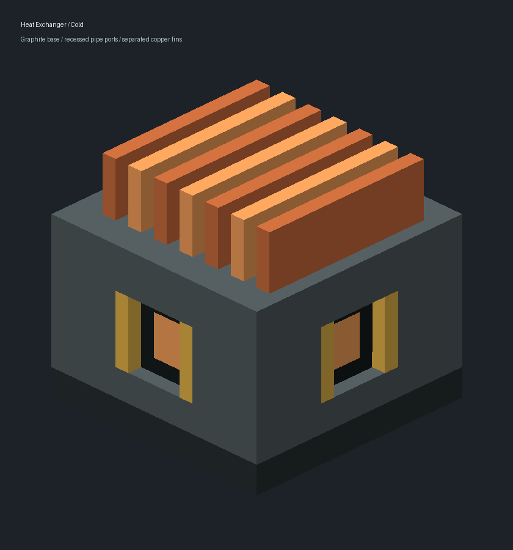

# 核换热器01B：九格制造与顶部鳍片

**后续状态（2026-10-04）：** 用户确认最新运行手测通过，01B随首期换热器及01C修复合入main，见[最终验收](../exchanger-01c/ACCEPTANCE.md)。以下为原候选交付记录。

**状态：候选整改、定向自动验证及独立审查通过，等待客户端人工验收。** 用户确认布局及写集见[01B任务卡](../../../superpowers/plans/2026-10-04-heat-exchanger-cost-model-revision.md)。本页接续[01A交付](../../2026-10-03/exchanger-01a/README.md)，旧21格配方和笼架模型由本批替代。

## 新制造与外观

工作台3×3制作1核换热器：3铜板、1核换热管束、5钢板。管束前置配方保持原样。

```text
铜 铜 铜
钢 束 钢
钢 钢 钢
```

模型为完整钢制方形基座，顶部是有真实凹槽的铜鳍片格栅，总体占一个方块；保留静态基座/鳍片/热态部件以便未来动画。顶部供热，其余五面冷热流体接口沿用原行为。

## 测试启动与人工项

完全退出旧客户端，从同级候选启动；主目录暂未包含本设备运行代码。

```powershell
Set-Location 'E:/MyMC/NewMod/Create_NuclearIndustry-ore-acquisition'
$env:JAVA_HOME = 'C:/Program Files/Java/jdk-21'
.\gradlew.bat runClient
```

1. JEI显示上述工作台9格布局；按图实际合成得到1台，原21格配方不再出现。
2. 物品栏、第一/第三人称手持、放置四朝向及热态外观正常；下方完整基座、顶部鳍片可辨认，无紫黑、漏缝和闪烁。
3. 01A尚未报告通过的真实反应堆热液→换热器→Create锅炉→冷液回路，以及断供/堵塞、拆放和卸载/重载仍保留。操作及预期见[01A清单B/C](../../2026-10-03/exchanger-01a/README.md#合并人工清单)；本次未改其运行参数，不要求重复已经实际完成且反馈通过的操作。

## 验证证据

- [配方及合并验证报告](./EXT-B-EXCHANGER-01B-RECIPE.md)：一次换热器命名空间GameTest共10项通过，包含修改后的原生工作台匹配与单件产量；随后assemble成功，测试服正常退出，详见[本次完整日志](./EXT-B-EXCHANGER-01B-RECIPE/validation.log)。因既有入口只支持命名空间，采用一次10项批次，未新建筛选框架，未跑JUnit或旧全量。
- [资源制品检查](./EXT-B-EXCHANGER-01B-RECIPE/static-check.txt)：7份JSON、10张PNG与JAR逐字节一致；PM复核测试JAR的SHA-256为`961F5005D60CBDD4BD3DEF119DA5AB79D84B8B7837FADCA7A46666548C794F65`。
- [模型报告](./EXT-B-EXCHANGER-01B-ART.md)及[资源摘要](./EXT-B-EXCHANGER-01B-ART/resource-validation.json)：单格坐标、显式UV、四朝向和物品变换检查通过；冷/热组合的同向共面正面积交叠均为0。离线检查不替代客户端视觉确认。
- [一次独立合并审查](./EXT-B-EXCHANGER-01B-REVIEW.md)已核对本批配方、模型与上述日志，未重复运行构建或测试。未改生产Java、供热参数和三种前置材料配方；01A的7项账本JUnit及未改逻辑审查继续复用，不冒充本轮新运行。



本批保持在同级候选，人工门前不合入main运行代码。主目录仅同步当前文档，用户启动配置与已有存档不动。
