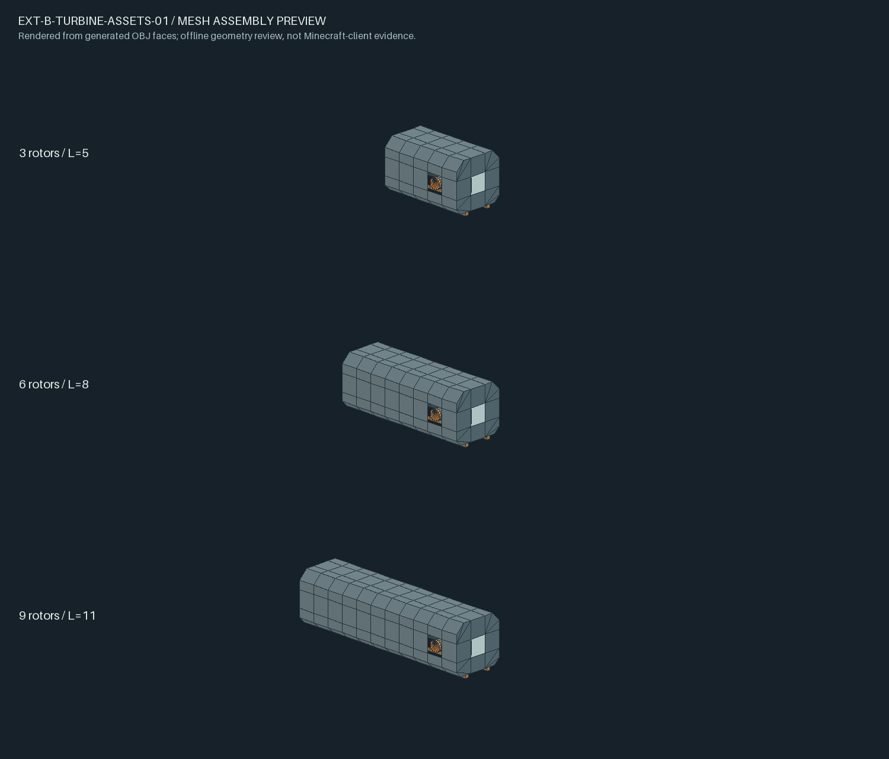

# EXT-B-TURBINE-01A：汽轮机与热端配置候选

状态：**需整改，人工仅部分通过。** 用户本轮报告前端无法出力、蒸汽紫黑和模型不理想，并要求粗细分档、侧置控制器与独立双轴、薄壳叶片和透明窗。详见[01B整改方案](../../../archive/2026-10-08-completed-plans/2026-10-04-turbine-structure-revision-proposal.md)。原自动证据保留其覆盖边界，不证明现场与视觉通过；功能不合入main，不开始冷凝回水。

先行资源整改：已补齐蒸汽两张sprite的图集来源，将游戏显示名改为“蒸汽”；JSON/PNG/资源复制及一次processResources通过，实际客户端效果待复测。详见[修复报告](./evidence/steam-fix/EXT-B-TURBINE-STEAM-FIX.md)。用户随后确认三档新尺寸并将转速改为256RPM，后续进度及新搭建清单统一见[01B交付页](../turbine-01b/README.md)，下文保留01A历史。

## 本批交付

- 汽轮机默认提供3×5×3、3×8×3、3×11×3三档，分别使用3/6/9个转子。按实际耗汽产生Create动力，前后轴分配同一份总SU，排出等体积普通蒸汽。
- 六件构件、工作台/动力合成配方、SVG纹理和逐格OBJ模型；成型有八棱切角及连续支座，端口按合法位置自动朝外。无GUI，护目镜查看状态，红石停止。
- 锅炉、换热器、汽轮机的平衡参数全部由服务端配置快照进入运行路径。默认值不改变已批准合同，旧容量缩小不直接删除液体。
- 配方继续保留为可覆盖的数据包JSON。坐标、物品身份、固定截面及1:1流体守恒属于结构不变量，不作为平衡开关。

使用方式见[配置指南](../../../server-config.md)和[合并人工清单](./manual-checklist.md)。功能候选位于 `E:/MyMC/NewMod/Create_NuclearIndustry-ore-acquisition`；从该目录运行 `./gradlew.bat runClient`。

## 已核验的证据

| 范围 | 结果 | 证据 |
| :--- | :--- | :--- |
| 锅炉/换热器纯状态 | 30/30 JUnit；增量assemble通过 | [配置交付](./evidence/EXT-B-CONFIG-01-evidence/EXT-B-CONFIG-01.md)及同目录XML/日志 |
| 已有热端真实管路 | 默认4/4，非默认1/1 required GameTest；保存完成、退出0 | 同上；保留实际非默认两份TOML |
| Create双轴探针 | 3/3 required GameTest；保存完成、退出0 | [双轴探针](./evidence/EXT-B-TURBINE-API-01-evidence/EXT-B-TURBINE-API-01.md) |
| 汽轮机账本 | 初轮8项，修补同tick恢复后9/9 JUnit通过 | 初轮[账本报告](./evidence/EXT-B-TURBINE-STATE-01-evidence/EXT-B-TURBINE-STATE-01.md)；最终XML位于[整机证据目录](./evidence/device/EXT-B-TURBINE-DEVICE-01.md) |
| SVG/OBJ/配方资源 | 39组OBJ及模型JSON、6个blockstate、6配方、自掉落与引用校验通过 | [资产报告](./evidence/assets/EXT-B-TURBINE-ASSETS-01.md) |
| 正式设备 | 默认3/3、非默认1/1 required GameTest；全维保存、退出0；最终assemble通过 | [整机交付](./evidence/device/EXT-B-TURBINE-DEVICE-01.md)及同目录最终日志、XML和实际运行TOML |
| 最终打包 | 121/121个新增/修改资源与JAR逐字节一致；两配置类及端口代理类均已打包 | [打包检查](./evidence/package-check.txt) |

本批按治理5.1复用已审证据，没有重复全项目测试。真实双轴探针覆盖分网/合网、外部源、停机和实际区块卸载；其中“全卸载”只指被明确观测的机器及外部源区块，不扩大声称所有中间连轴区块均卸载。新机组复用同一轴源基础类，正式设备的结构/流体/拆放另测。

非默认热端配置验证每段36HU/t、2HU/mB、每口128mB/t和不同容量；容量缩小及NBT恢复还有纯状态断言。没有把这些记录冒充用户实际存档重启或客户端视觉验证。

汽轮机非默认场景实际形成4转子机组，验证60mB/t、5000/6000mB容量、96RPM、20tick窗口、16384转换系数与前轴25%份额进入真实Create网络。TOML首次启动被NeoForge补齐注释/格式，18个键值均未改变；归档的是实际运行后文件。配置文件位置也由隔离服务端生成记录和锁定NeoForge源码核对。

## PM审查整改

已处理：同tick恢复不能重复加工；后轴完整朝向变化重建Create连接；端口成型自动向外；中文/英文状态和空载耗汽提示齐全；旧句柄绑定成型世代，旧结构清理限定本模组六件；归属核验以实际有效控制器为准，不用旧formed外观位阻止重建；远处机组先按包围盒排除，不互扫完整结构。

真实管路测试暴露Create对端口的方块实体前置检查，已为进、排汽口增加无库存代理实体。修复后无泵管道向Create储罐输送普通蒸汽、总量守恒通过；库存仍只有控制器一份。

资源侧已去掉重复底部斜面、修正斜面法线、补齐端盖/安装板及真实支座，添加粒子材质和完整物品显示变换。控制器配方的空位使用合法空格字符，方案中的点号仅作示意。

模型采用锁定NeoForge内置静态OBJ加载器，无新增依赖或自定义整机渲染器。以下图来自实际OBJ面的离线拼接，只能检查几何，不能证明游戏中材质烘焙、光照、手持和接缝已通过：

## 待人工门

用户需按合并清单确认三档搭建、管路/动力、保存拆放与外观。配置默认在候选 `run/config/` 生成，世界 `serverconfig/` 已有同名文件时覆盖；具体文件名和单位见配置指南。

冷凝回水、锅炉可变尺寸与规模容量公式、完整压力/普通热产汽、工作盆加热和动画均未包含在本批。人工通过后再推进下一批。
